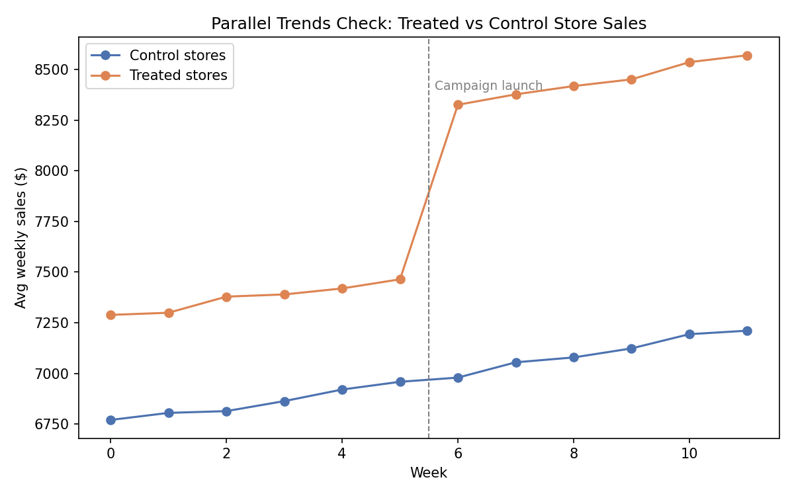
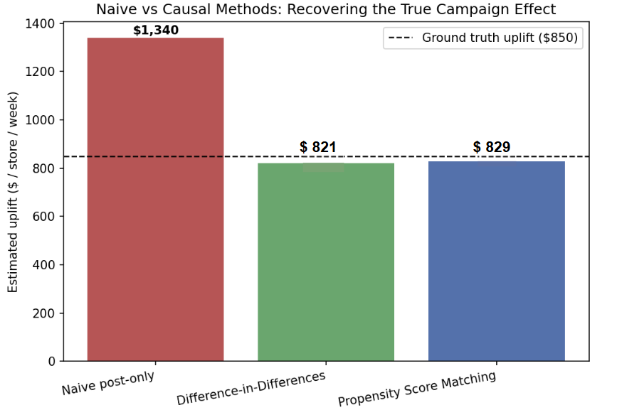

# Marketing Campaign Causal Uplift Analysis

**Question:** A retail chain rolls out a marketing campaign to some stores but not others — but store selection wasn't random (bigger, urban stores were targeted first). How much did the campaign *actually* cause sales to increase, net of the fact that treated stores were already stronger performers?

This project compares a naive (biased) comparison against two causal inference methods — **Difference-in-Differences** and **Propensity Score Matching** — to recover an unbiased estimate of the campaign's true effect.

## Why this matters for a Data Analyst / Data Scientist role
Most "which stores got the campaign performed better" analyses stop at a simple average comparison, which conflates the campaign's effect with the fact that treated stores were bigger and more urban to begin with. This project shows the ability to recognize confounding/selection bias and correct for it — a core skill for marketing analytics, product analytics, and experimentation roles.

## Data
The dataset is **simulated** (200 stores × 12 weeks, `01_generate_data.py`), with a known ground-truth causal effect (**$850/store/week**) built into the simulation. This is a deliberate design choice: it lets the analysis be validated against a known answer, the same way you'd validate a method before trusting it on real, unlabeled business data. Store assignment to treatment is **not random** — it's a function of store size and urban location — to mimic how real campaigns are usually targeted at "promising" stores rather than randomly assigned.

## Method & Results

| Method | Estimated Uplift | Notes |
|---|---|---|
| Naive post-only comparison | **$1,340** | Overstated — confounds campaign effect with pre-existing store differences |
| Difference-in-Differences (OLS, store-clustered SE) | **$821** (95% CI: $788–$855) | Differences out each store's fixed baseline, isolating the campaign's effect |
| Propensity Score Matching (nearest-neighbor on pre-period covariates) | **$829** | Independent robustness check using a different identification strategy |

Both causal methods land within ~3% of the true simulated effect ($850), while the naive comparison overstates it by ~58%.

**Parallel trends check** (below) confirms treated and control stores moved together before the campaign launched — the key assumption DiD relies on:

## Files
- `scripts/01_generate_data.py` — simulates the store-week panel dataset
- `scripts/02_analysis.py` — naive comparison, DiD (manual OLS with cluster-robust SE), and PSM
- `scripts/03_plots.py` — generates the two charts above
- `dataset/campaign_panel.csv` — generated panel dataset
- `uplift-analysis/results_summary.csv` — final uplift estimates by method

## Tools
Python, Pandas, NumPy, scikit-learn (propensity model + nearest-neighbor matching), Matplotlib. DiD regression and cluster-robust standard errors implemented manually via matrix algebra (no `statsmodels` dependency).

## Notes on extending this
On real data, next steps would be: event-study plot (leads/lags around launch) to test parallel trends more rigorously, synthetic control for a small number of treated units, and heterogeneous treatment effects (does uplift differ by store size?).
